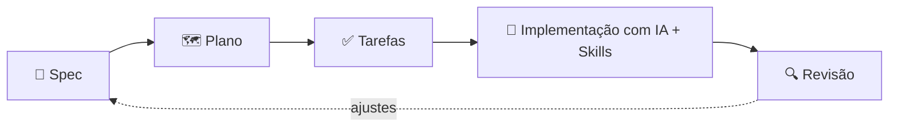
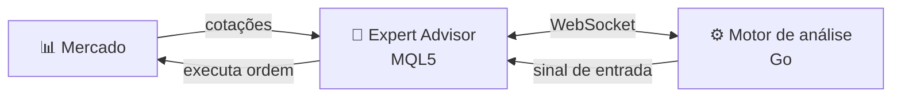

<!-- Header -->

  

  

  
  
  
  

---

## 👨‍💻 Sobre mim

Seja bem-vindo ao meu espaço no GitHub! Aqui você encontrará projetos, contribuições e experimentações nas tecnologias com que mais gosto de trabalhar.

- 🔭 Foco em **desenvolvimento backend** com **Go** e **Java**
- 📡 Atenção especial a **monitoramento e observabilidade**
- 🗄️ Experiência com bancos **relacionais e NoSQL**
- 🤖 Desenvolvimento com **IA**, **Skills** e **Spec-Driven Development**
- 📦 Autor de bibliotecas **.NET** no NuGet com **136 mil+ downloads**
- 🎯 Entusiasta de apps com **Flutter**, análise de probabilidades com **Python/Go** e **Expert Advisors** em **MQL5 + Go**
- 🌱 Sempre aprendendo e buscando novos desafios
- 💬 Fale comigo pelo **LinkedIn** ou **WhatsApp**

 

---

## 🧰 Stack principal

  

<table align="center">
  <tr>
    <th align="left">Categoria</th>
    <th align="left">Tecnologias</th>
  </tr>
  <tr>
    <td>💻 <b>Linguagens</b></td>
    <td>
      
      
      
      
    </td>
  </tr>
  <tr>
    <td>📡 <b>Observabilidade</b></td>
    <td>
      
      
      
    </td>
  </tr>
  <tr>
    <td>🗄️ <b>Banco de Dados</b></td>
    <td>
      
      
      
      
      
    </td>
  </tr>
  <tr>
    <td>📨 <b>Mensageria & Async</b></td>
    <td>
      
      
    </td>
  </tr>
  <tr>
    <td>📋 <b>Gestão & Docs</b></td>
    <td>
      
      
      
    </td>
  </tr>
  <tr>
    <td>🖥️ <b>Sistemas Operacionais</b></td>
    <td>
      
      
      
    </td>
  </tr>
</table>

---

## 🤖 Desenvolvimento com IA

A IA faz parte do meu fluxo de desenvolvimento diário: uso agentes de código de forma **estruturada e orientada a especificações**, não só como autocomplete.

<table>
  <tr>
    <td width="50%" valign="top">
      <h3>🧩 Skills</h3>
      <ul>
        <li><b>Crio skills</b> que empacotam conhecimento do time, padrões de código e fluxos repetitivos em instruções reutilizáveis para agentes</li>
        <li><b>Uso e adapto skills</b> criadas por outros colaboradores, aproveitando o conhecimento compartilhado entre times</li>
        <li>Resultado: respostas mais consistentes, alinhadas ao contexto do projeto e menos retrabalho</li>
      </ul>
    </td>
    <td width="50%" valign="top">
      <h3>📐 Spec-Driven Development</h3>
      <ul>
        <li>Desenvolvimento guiado por <b>especificação → plano → tarefas → implementação</b></li>
        <li><b>Meli SDD</b> no dia a dia de trabalho</li>
        <li><a href="https://github.com/github/spec-kit"><b>GitHub Spec Kit</b></a> (SDD open source) para estudos e projetos pessoais</li>
        <li>A spec vira a fonte da verdade: requisitos claros, decisões rastreáveis e código mais previsível</li>
      </ul>
    </td>
  </tr>
</table>

---

## 🎯 Projetos Pessoais & Interesses

Fora do trabalho, sou entusiasta de duas áreas que uso para estudar e experimentar:

<table>
  <tr>
    <td width="50%" valign="top">
      <h3>📱 Apps com Flutter</h3>
      

        
        
      

      <ul>
        <li>Criação de apps <b>multiplataforma</b> (Android, iOS e web) com uma única base de código</li>
        <li>Interfaces modernas e prototipação rápida de ideias</li>
      </ul>
    </td>
    <td width="50%" valign="top">
      <h3>🎲 Análise de Probabilidades</h3>
      

        
        
      

      <ul>
        <li>Modelagem estatística e cálculo de probabilidades</li>
        <li><b>Python</b> para exploração e análise de dados; <b>Go</b> para simulações de alto desempenho</li>
      </ul>
    </td>
  </tr>
  <tr>
    <td colspan="2" valign="top">
      <h3>📈 Expert Advisors com MQL5 + Go</h3>
      

        
        
        
        
      

      <ul>
        <li>Desenvolvimento de <b>Expert Advisors (EAs)</b> em <b>MQL5</b> para operar no mercado financeiro</li>
        <li><b>Go</b> como motor de análise: identifica os melhores momentos de entrada a partir dos dados de mercado</li>
        <li>Comunicação em tempo real via <b>WebSocket</b>, com conexões simultâneas entre o motor em Go e os EAs</li>
        <li>O EA em MQL5 recebe o sinal e <b>executa as ordens</b> no mercado</li>
      </ul>
    </td>
  </tr>
</table>

---

## 📦 Bibliotecas Open Source

  
  

Bibliotecas **.NET / C#** que publiquei no NuGet para resolver problemas recorrentes em APIs. Hoje estão sem manutenção ativa, mas juntas somam **mais de 136 mil downloads** pela comunidade.

<table align="center">
  <tr>
    <th align="left">Pacote</th>
    <th align="left">Descrição</th>
    <th align="center">Versão</th>
    <th align="center">Downloads</th>
  </tr>
  <tr>
    <td><a href="https://www.nuget.org/packages/Cabother.Exceptions"><b>Cabother.Exceptions</b></a></td>
    <td>Suporte ao uso de exceções customizadas</td>
    <td align="center"></td>
    <td align="center"></td>
  </tr>
  <tr>
    <td><a href="https://www.nuget.org/packages/Cabother.Validations.Helpers"><b>Cabother.Validations.Helpers</b></a></td>
    <td>Validação de objetos e tipos primitivos</td>
    <td align="center"></td>
    <td align="center"></td>
  </tr>
  <tr>
    <td><a href="https://www.nuget.org/packages/Cabother.Swagger.UI"><b>Cabother.Swagger.UI</b></a></td>
    <td>Swagger com múltiplas versões de controllers</td>
    <td align="center"></td>
    <td align="center"></td>
  </tr>
  <tr>
    <td><a href="https://www.nuget.org/packages/Cabother.Helpers"><b>Cabother.Helpers</b></a></td>
    <td>Métodos utilitários customizados</td>
    <td align="center"></td>
    <td align="center"></td>
  </tr>
</table>

---

## 📊 Estatísticas

  
  

  

---

  💡 <i>Sempre explorando novas tecnologias e buscando desafios! Sinta-se à vontade para entrar em contato ou explorar meus repositórios.</i>

<!-- Footer -->

  

